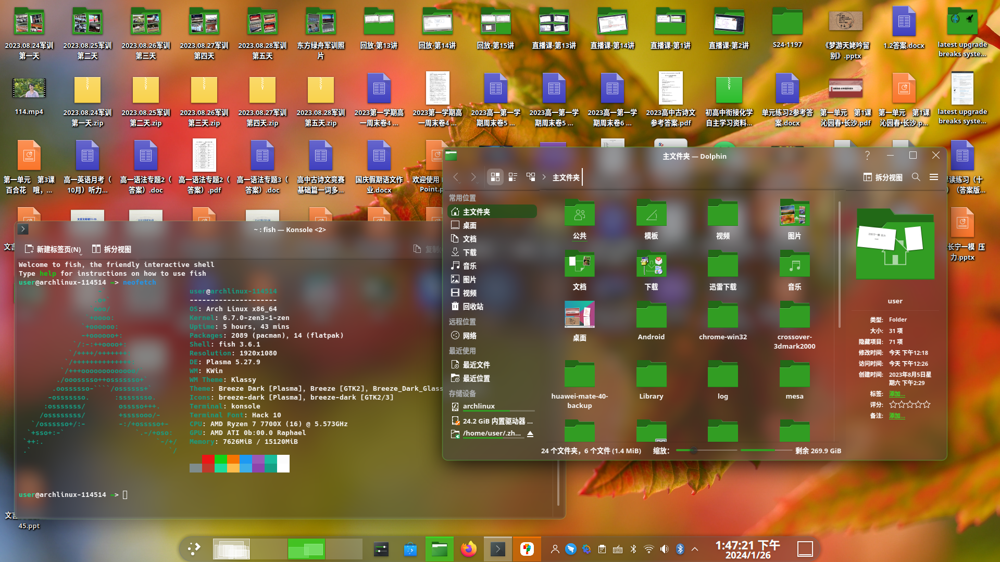

# About this repository
It contains my config for KDE Plasma desktop (5).


#Installation
First, install `Lightly` and `Klassy`  
Next copy files
```
cp -r config/* ~/.config
cp -r data/* ~/.local/share
```
You may need to set color scheme (and maybe some other configs) manually  
At last, restart KDE Plasma if needed.
